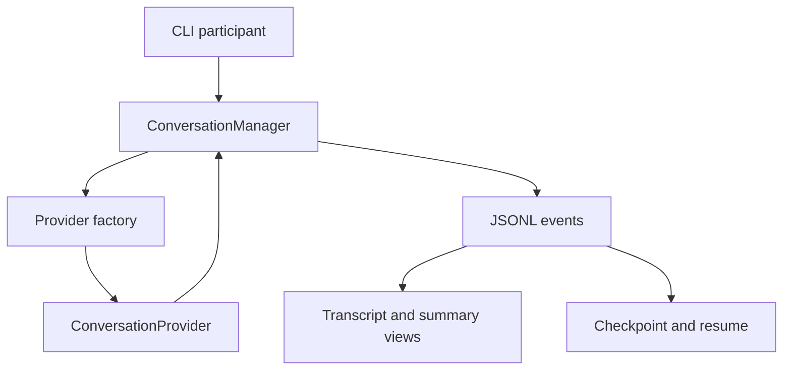

# Architecture

The stable boundary is the normalized event stream:

`ConversationManager` owns the interview session identity and assigns monotonic event
sequences. Providers own connection mechanics and emit provider-neutral payloads. The
manager never persists SDK objects or provider-specific protocol envelopes.

## Lifecycle

1. The factory selects a provider from typed configuration.
2. The manager creates a stable interview session ID and starts event consumption.
3. The provider emits lifecycle, transcript, response, warning, and error payloads.
4. The manager replaces provider placeholder sequences with canonical monotonic sequences.
5. Every canonical event is appended and fsynced before consumers treat it as durable.
6. Checkpoints capture provider recovery state and the last durable sequence.
7. Resume reuses the interview ID, restores provider state, and continues sequencing.
8. Transcript and Markdown summary are regenerated from normalized events.

The checkpoint deliberately does not replace the event log. It makes recovery fast without
turning opaque provider state into the source of truth.

## Capability negotiation

Every provider exposes the same capability shape:

`native_audio`, `native_vad`, `barge_in`, `async_tools`, `session_renewal`,
`local_execution`, `text_injection`, and `transcript_events`.

The manager preserves those differences. An unsupported operation raises an explicit error;
it is not silently converted into a misleading success.

## Current provider boundary

- `mock`: complete in-process implementation with deterministic timing.
- `parlor-gemma`: health/configuration boundary plus representative event translation. Live
  WebSocket transport is the next Mac slice.
- `nova-sonic`: prerequisite/configuration boundary plus representative event translation.
  Live bidirectional transport and renewal are the next AWS slice.

